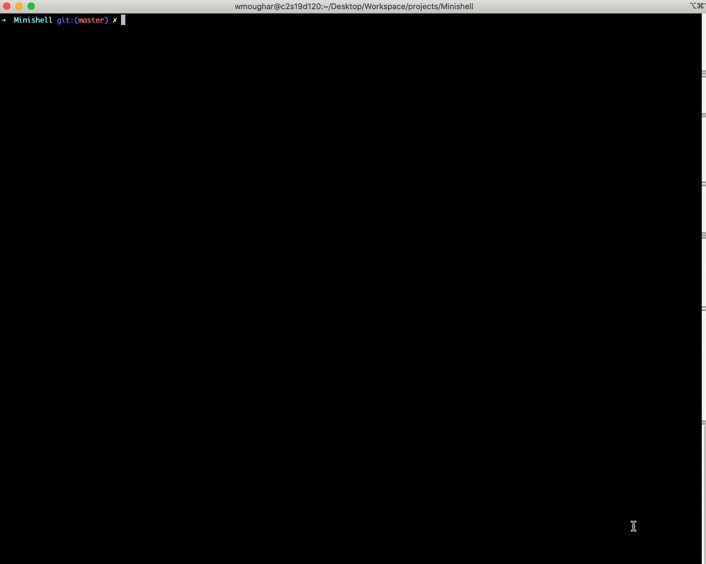

<h1><b></b>Minishell</b></h1>

<h2>Overview</h2>
Minishell is a fundamental project in the 42 curriculum, designed to teach students the inner workings of a shell and help them gain a deep understanding of processes, system calls, and Unix-like operating systems. This project challenges students to create a simplified version of a Unix shell, which is a crucial component of any modern computer system.

<h2>Project Description:</h2>
The Minishell project is an integral part of the 42 curriculum, known for its hands-on approach to teaching software engineering skills. In this project, students are tasked with developing a basic shell that can perform various operations, including executing commands, managing environment variables, and handling signals. The goal is to create a functional and efficient shell that mimics the behavior of the standard Unix shell, such as bash.

<h2>Key Features:</h2>

    Command Execution: Minishell should be able to execute commands entered by the user, whether they are built-in commands or external executables located in the system's PATH.

    Environment Variables: Students must implement the ability to manage environment variables, allowing users to set, unset, and modify them.

    Redirection and Pipes: Minishell should support input and output redirection, as well as the use of pipes to connect multiple commands together.

    Error Handling: Proper error handling and informative error messages are essential for a robust shell. Students need to ensure that Minishell provides clear and meaningful error messages when issues arise.

    Signal Handling: The shell should handle signals such as Ctrl+C (SIGINT) and Ctrl+\ (SIGQUIT) gracefully, allowing users to interrupt or quit running processes.

    Line Editing: Basic line editing features like moving the cursor left and right, deleting characters, and history management should be implemented.

    Built-in Commands: Minishell should include some built-in commands like "echo," "cd," "pwd," and "env."

Challenges:
Developing Minishell can be a complex and challenging task for students. Some of the difficulties they may encounter include:

    Parsing: Properly parsing user input to separate commands, arguments, and operators can be tricky.

    Managing Processes: Understanding and managing child processes and executing commands within them require a solid grasp of system calls and process management.

    Handling Signals: Implementing signal handling and ensuring processes respond correctly to signals like SIGINT and SIGQUIT can be complex.

    Error Handling: Writing effective error messages and handling errors gracefully is crucial for a user-friendly shell.

Learning Outcomes:
By completing the Minishell project, students gain practical experience and knowledge in several key areas:

    Unix-like Systems: A deeper understanding of how Unix-like operating systems work, including processes, signals, and file I/O.

    C Programming: Enhancing their C programming skills by working on a real-world project with complex requirements.

    Problem-Solving: Developing problem-solving skills and the ability to debug and optimize code.

    Shell Concepts: Learning the fundamental concepts of shell scripting and command execution.

    Collaboration: Practicing teamwork and collaboration, as students often work in pairs on this project.
